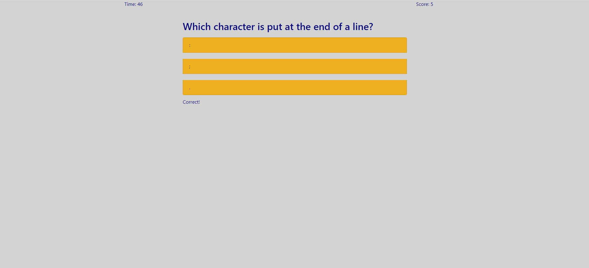

# CodingQuiz

## Description:
The JavaScript Coding Quiz is a 20 question timed quiz to test a users knowledge of basic JavaScript concepts. Local storage is used to store past attempts.

## Screenshot:

## Link:
The GitHub Repo can be found at: https://github.com/sziccardi1998/CodingQuiz.git 
The hosted application can be found at: https://sziccardi1998.github.io/CodingQuiz/